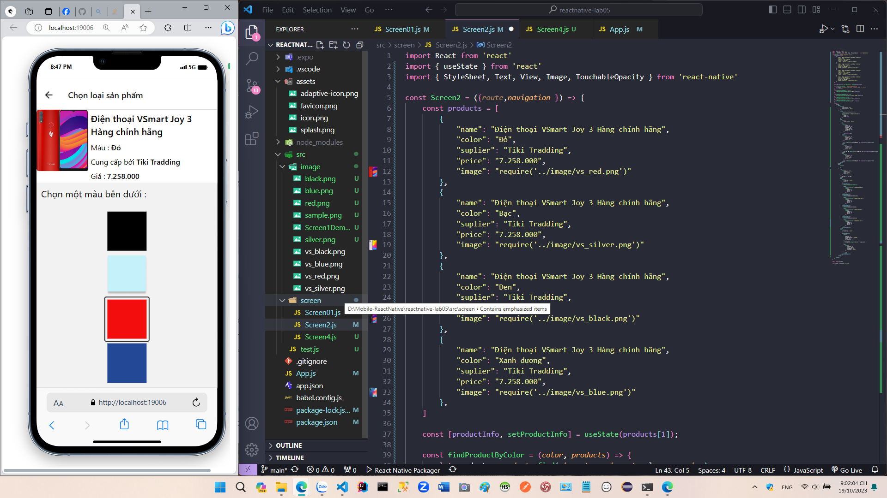

# Sample React native UI - Lab5

Lập trình thiết bị di động với React-native lab-5

## Mô Tả Dự Án

- Thiết kế ác màn hình cơ bản với react-native
- Sử dụng react Navigation để tạo stack và di chuyển giữa các trang
- Truyền dữ liệu giữa các trang với Navigation và route
- hook useState
- Material UI Icon

## Các thành phần chính 

Dưới đây là danh sách các thành phần đã làm:

- Màn hình 1 : Màn hình bắt đầu

Ở màn hình này, chọn vào nút 4 mẫu chọn màu để chuyển sang trang Screen2 và thực hiện chọn màu

- Màn hình 2 : Thực hiện chọn màu 

Ở màn hình này, khi chọn vào một màu thì thông tin hình ảnh của sản phẩm sẽ được thay đổi theo

Đây là dữ liệu của các sản phẩm : 

 Đây là xử lí để thay đổi thông tin các sản phẩm khi được chọn màu 
 

 Khi chọn màu xong, nhấn vào nút xong để chuyển qua trang Screen4 và xasv nhận mua
 

 Khi bấm vào mua, ứng dụng sẽ hiện thị alert về thông tin sản phẩm được chọn mua 

 

## Hướng Dẫn Cài Đặt

- Clone repository :
Mở cmd trong thư mục cần lưu và chạy lệnh : `git clone https://github.com/nhatlinhdev201/reactnative-lab05.git`

Di chuyển vào ứng dụng, chạy lệnh `cd reactnative-lab05`

- Tải các modules ứng dụng :
Tại cmd chạy lệnh `npm install`

- Chạy ứng dụng : 
Chạy lệnh : `npm run web`

## Dự án được thực hiện bởi Pham Nhat Linh
 Email : nhatlinhdev201@gmail.com
 

